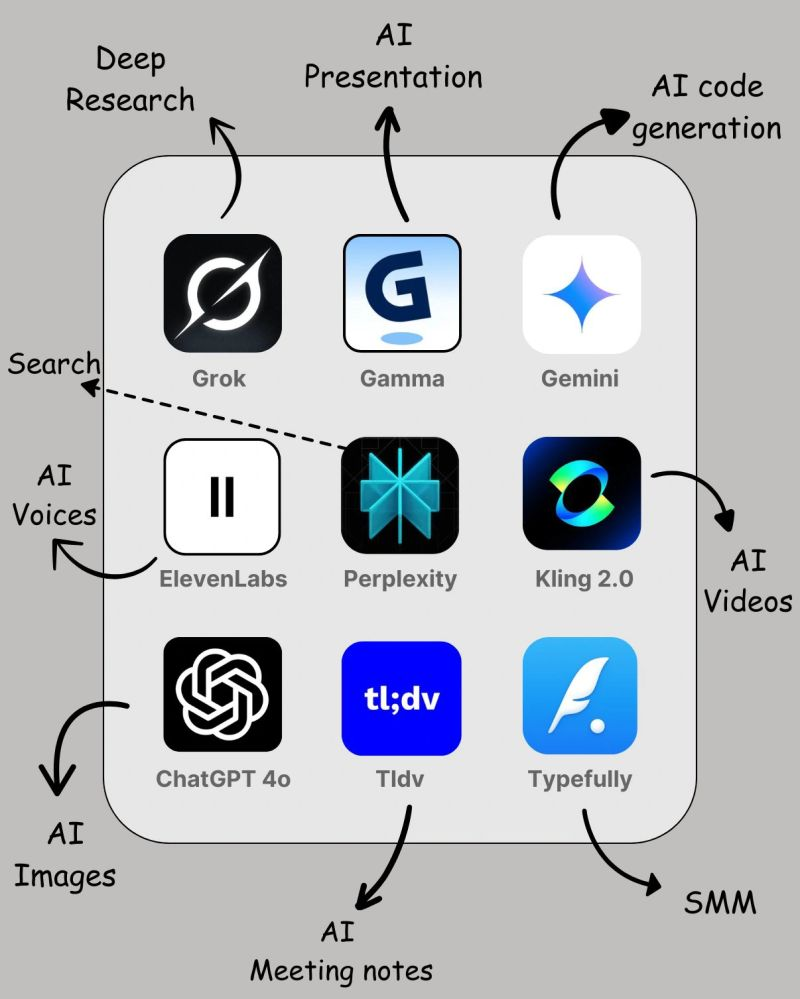

## 𝟲𝟬 𝗔𝗜 𝗧𝗼𝗼𝗹𝘀 𝘁𝗼 𝗿𝗲𝗽𝗹𝗮𝗰𝗲 𝘆𝗼𝘂𝗿 𝘁𝗲𝗱𝗶𝗼𝘂𝘀 𝘄𝗼𝗿𝗸:

|                                                                                                                                                                                                                                      |                                                                                                                                                                                                                                                                             |                                                                                                                                                                                                                                                                           |
|--------------------------------------------------------------------------------------------------------------------------------------------------------------------------------------------------------------------------------------|-----------------------------------------------------------------------------------------------------------------------------------------------------------------------------------------------------------------------------------------------------------------------------|---------------------------------------------------------------------------------------------------------------------------------------------------------------------------------------------------------------------------------------------------------------------------|
| **1. Productivity**  [Gamma](https://gamma.app/)   [Grok 3](https://grok.com/)   [Perplexity AI](https://www.perplexity.ai/)   [Gemini 2.5 Flash](https://deepmind.google/technologies/gemini/flash/)               | **2. Research**      [ChatGPT](https://openai.com/chatgpt/)   [YouChat](https://you.com/)   [Abacus](https://abacus.ai/)   [Perplexity](https://www.perplexity.ai/)   [Copilot](https://copilot.microsoft.com/)   [Gemini](https://gemini.google.com/) | **3. Image**      [Fotor](https://www.fotor.com/)   [Stability AI](https://stability.ai/)   [GPT-4o](https://openai.com/index/hello-gpt-4o/)   [Midjourney](https://www.midjourney.com/)   [Microsoft Designer](https://designer.microsoft.com/)         |
| **4. Writing**      [Jasper](https://www.jasper.ai/)   [Jenny AI](https://jenni.ai/)   [Textblaze](https://blaze.today/)   [Quillbot](https://quillbot.com/)                                                           | **5. Video**      [Klap](https://klap.app/)   [Kling](https://klingai.com/)   [InVideo](https://invideo.io/)   [HeyGen](https://www.heygen.com/)   [Runway](https://runwayml.com/)                                                                        | **6. Meeting**      [Tldv](https://tldv.io/)   [Otter](https://otter.ai/)   [Noty AI](https://noty.ai/)   [Fireflies](https://fireflies.ai/)                                                                                                                |
| **7. SEO**      [VidIQ](https://vidiq.com/)   [Seona AI](https://seona.ai/)   [BlogSEO](https://www.blogseo.ai/)   [Keywrds AI](https://keywrds.ai/)   [Outrank AI](https://www.outrank.so/)                        | **8. Presentation**      [Decktopus](https://www.decktopus.com/)   [Slides AI](https://www.slidesai.io/)   [Gamma AI](https://gamma.app/)   [Designs AI](https://designs.ai/)   [Beautiful AI](https://www.beautiful.ai/)                                  | **9. Design**      [Canva](https://www.canva.com/)   [Flair AI](https://flair.ai/)   [Designify](https://designify.com/)   [Clipdrop](https://clipdrop.co/)   [Autodraw](https://www.autodraw.com/)   [Magician design](https://magician.design/)    |
| **10. Audio**      [Lovo ai](https://lovo.ai/)   [Eleven labs](https://elevenlabs.io/)   [Songburst AI](https://www.songburst.ai/)   [Adobe Podcast](https://podcast.adobe.com/)                                       | **11. Marketing**      [Pencil](https://www.trypencil.com/)   [AI-Ads](https://www.adgenai.com/)   [AdCopy](https://adcopy.ai/)   [Simplified](https://simplified.com/)   [AdCreative](https://www.adcreative.ai/)                                        | **12. Startup**      [Tome](https://tome.app/)   [Ideas AI](https://ideanote.io/idea-generator)   [Namelix](https://namelix.com/)   [Pitchgrade](https://pitchgrade.com/)   [Validator AI](https://validatorai.com/)                                    |
| **13. Social Media Management**      [Tapilo](https://taplio.com/)   [Typefully](https://typefully.com/)   [Hypefury](https://hypefury.com/)   [TweetHunter](https://tweethunter.io/)                              |                                                                                                                                                                                                                                                                             |                                                                                                                                                                                                                                                                           |

Credit to [Mohan Nayak](https://www.linkedin.com/in/mohan-nayak-49954392/) taken from his original post at [https://www.linkedin.com/feed/update/urn:li:activity:7321189193714421761/](https://www.linkedin.com/feed/update/urn:li:activity:7321189193714421761/)